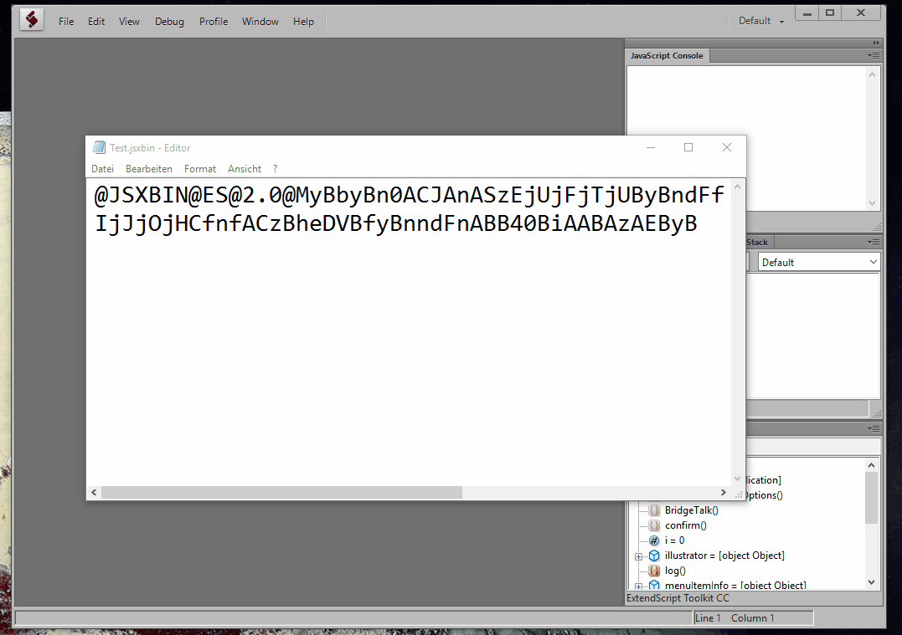

# Introduction to ExtendScript Toolkit JSXBIN to JSX converter plugin
[JSXBIN to JSX converter](https://github.com/autoboosh/jsxbin-to-jsx-converter) allows you to decode .jsxbin to .jsx files using the command line. This gets tedious after a while if you have many scripts to decode. That is why this little plugin was born which allows you to open .jsxbin files directly inside of ExtendScript Toolkit as if they had always been in cleartext.

# Demo

# Installation
1. Grab and extract the [latest release somewhere on your PC](https://github.com/autoboosh/extendscript-toolkit-jsxbintojsx-plugin/releases)
2. Copy the converter directory to somewhere on your PC where you have read/write permissions
3. Grab and extract the latest [JSXBIN to JSX converter](https://github.com/autoboosh/jsxbin-to-jsx-converter/releases) and put it inside of the converter directory
4. As administrator: Change C:\Program Files (x86)\Adobe\Adobe ExtendScript Toolkit CC\Required\10application.jsx as described in the 10application_changes.txt file. The 10application_example.txt file shows you how it is supposed to look in the end but since there may be different versions of the file in the wild it is important that you apply the changes manually.
5. As administrator: Open 1337jsxbinconverter.jsx and change CONVERTER_FOLDER to the path where you put the converter directory
6. Copy 1337jsxbinconverter.jsx to C:\Program Files (x86)\Adobe\Adobe ExtendScript Toolkit CC\Required\
7. Start ExtendScript Toolkit and use File->Open as you usually would. Only this time open a .jsxbin file. It should be automatically converted in the background with the decoded file being created in the same folder as the .jsxbin file

# Feedback
If you encounter any problems, please create an issue.